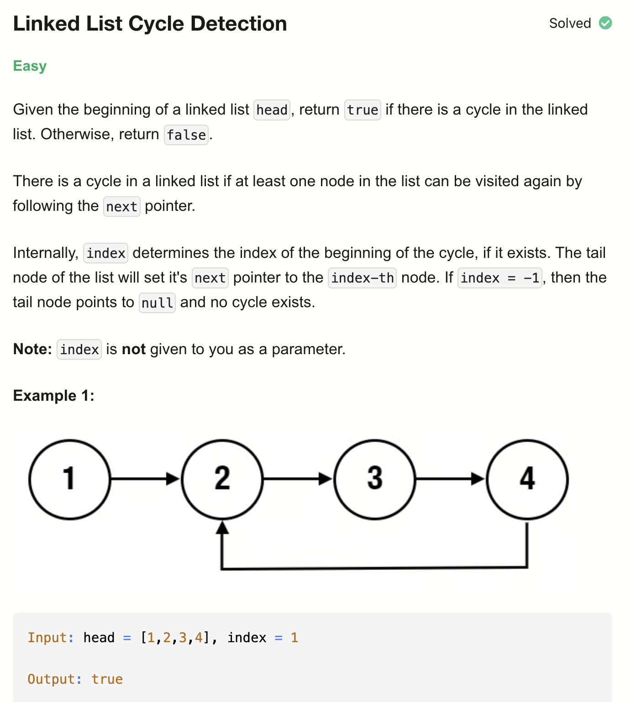
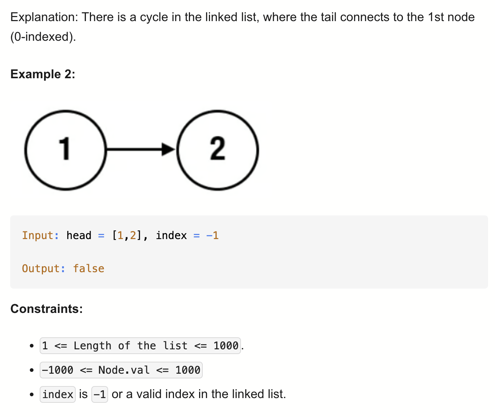

# 141-Linked List Cycle Detection-E

## 题目描述



题意：
- 给定一个链表的头节点，判断链表是否有环，返回bool

解法：
- Fast And Slow Pointers
- Hash Set

## 1. Hash Set
```python
# Definition for singly-linked list.
# class ListNode:
#     def __init__(self, val=0, next=None):
#         self.val = val
#         self.next = next

class Solution:
    def hasCycle(self, head: Optional[ListNode]) -> bool:
        seen = set()
        cur = head
        while cur:
            if cur in seen:
                return True
            seen.add(cur)
            cur = cur.next
        return False
```

- TC: O(n)
- SC: O(n)


## 2. Fast And Slow Pointers
```python
# Definition for singly-linked list.
# class ListNode:
#     def __init__(self, val=0, next=None):
#         self.val = val
#         self.next = next

class Solution:
    def hasCycle(self, head: Optional[ListNode]) -> bool:
        slow, fast = head, head

        while fast and fast.next:
            slow = slow.next
            fast = fast.next.next
            if slow == fast:
                return True
        return False
```

- TC: O(n)
- SC: O(1)