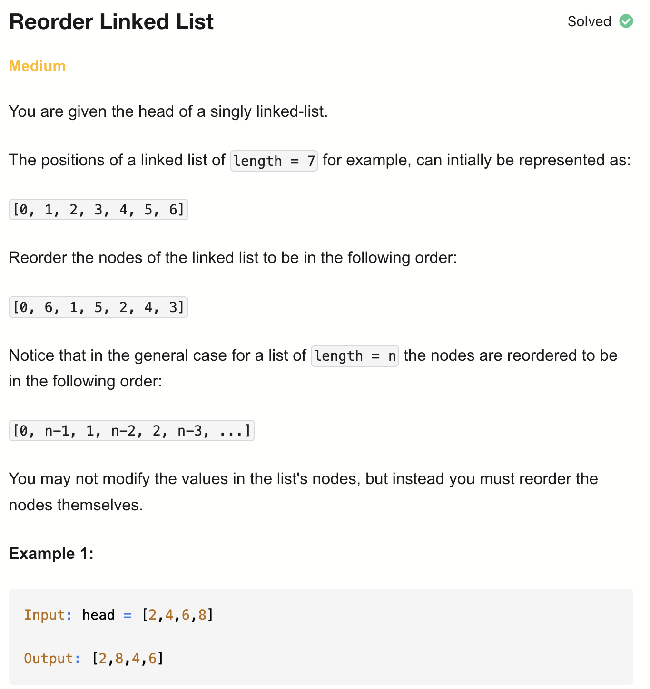
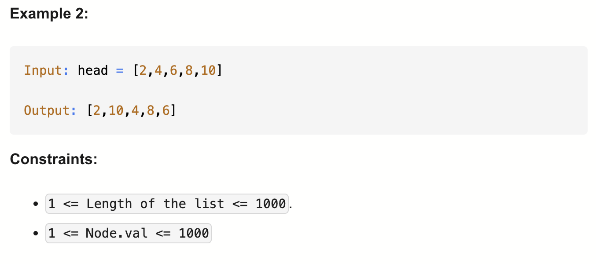

# 143-Reorder List-M

## 题目描述



题意：
- 给一个单链表的头节点，将链表重新排序
- 从[0, 1, 2, 3 ..., n-1] 改为 [0, n-1, 2, n-2, 3, n-3, ...]


解法：
- Recursion
- linked list -Reverse And Merge

## 1. Brute Force
```python
# Definition for singly-linked list.
# class ListNode:
#     def __init__(self, val=0, next=None):
#         self.val = val
#         self.next = next

class Solution:
    def reorderList(self, head: Optional[ListNode]) -> None:
        if not head:
            return

        nodes = []
        cur = head
        while cur:
            nodes.append(cur)
            cur = cur.next

        i, j = 0, len(nodes) - 1
        while i < j:
            nodes[i].next = nodes[j]
            i += 1
            if i >= j:
                break
            nodes[j].next = nodes[i]
            j -= 1

        nodes[i].next = None
```

- TC: O(n)
- SC: O(n)

## 2. Recursion
```python
# Definition for singly-linked list.
# class ListNode:
#     def __init__(self, val=0, next=None):
#         self.val = val
#         self.next = next

class Solution:
    def reorderList(self, head: Optional[ListNode]) -> None:

        def rec(root: ListNode, cur: ListNode) -> ListNode:
            if not cur:
                return root

            root = rec(root, cur.next)
            if not root:
                return None

            tmp = None
            if root == cur or root.next == cur:
                cur.next = None
            else:
                tmp = root.next
                root.next = cur
                cur.next = tmp

            return tmp

        head = rec(head, head.next)
```

- TC: O(n)
- SC: O(n)

## 3. Reverse And Merge
```python
# Definition for singly-linked list.
# class ListNode:
#     def __init__(self, val=0, next=None):
#         self.val = val
#         self.next = next

class Solution:
    def reorderList(self, head: Optional[ListNode]) -> None:
        # 找中间点
        slow, fast = head, head.next
        while fast and fast.next: # 注意这个判断条件
            slow = slow.next
            fast = fast.next.next
        
        # 反转第二段链表
        second = slow.next
        prev = slow.next = None
        while second:
            tmp = second.next
            second.next = prev
            prev = second
            second = tmp
        
        # 合并两段链表
        first, second = head, prev
        while second:
            tmp1, tmp2 = first.next, second.next
            first.next = second
            second.next = tmp1
            first, second = tmp1, tmp2
```

- TC: O(n)
- SC: O(1)

分析：
- 找的中间点，也就是第二段的开头的前一个，slow = second.prev
- prev = slow.next = None
  - 其实是a = b = 0的意思，并非prev = slow.next
  - 也就是可以拆做两行：
    - prev = None
    - slow.next = None 
    - 将第一段与第二段彻底分开

- 下面合并的代码里while second： 是因为second更长
  - 奇数1，2，3时，second = 2，第二段长于第一段; 
  - 奇数1，2，3，4时，second = 2，第二段等于第一段
- 合并过程中只做两个next指针的重新赋值