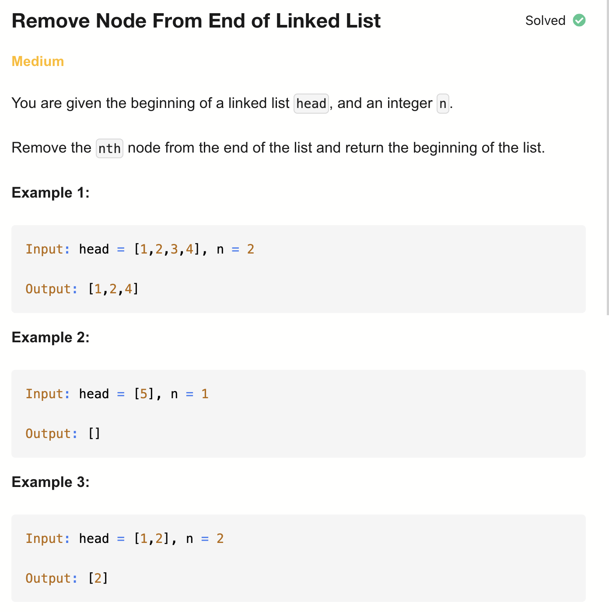
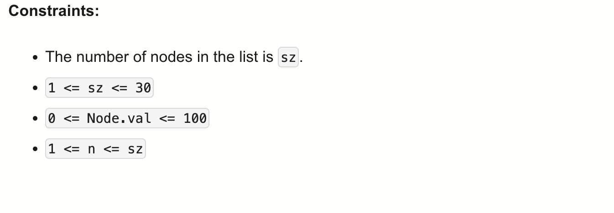

# 19-Remove Node From End of Linked List-M

## 题目描述



题意：
- 给定一个链表的头节点 head 和一个整数 n ，
- 删除链表的倒数第 n 个节点，并返回其头节点

解法：
- Iteration (Two Pass)
- Recursion
- Two Pointers

## 1. Iteration (Two Pass)
```python
# Definition for singly-linked list.
# class ListNode:
#     def __init__(self, val=0, next=None):
#         self.val = val
#         self.next = next

class Solution:
    def removeNthFromEnd(self, head: Optional[ListNode], n: int) -> Optional[ListNode]:
        N = 0
        cur = head
        while cur:
            N += 1
            cur = cur.next

        removeIndex = N - n
        if removeIndex == 0:
            return head.next

        cur = head
        for i in range(N - 1):
            if (i + 1) == removeIndex:
                cur.next = cur.next.next
                break
            cur = cur.next
        return head
```

- TC: O(N)
- SC: O(1)


## 2. Recursion
```python
# Definition for singly-linked list.
# class ListNode:
#     def __init__(self, val=0, next=None):
#         self.val = val
#         self.next = next

class Solution:
    def rec(self, head, n):
        if not head:
            return None

        head.next = self.rec(head.next, n)
        n[0] -= 1
        if n[0] == 0:
            return head.next
        return head

    def removeNthFromEnd(self, head, n):
        return self.rec(head, [n])
```

- TC: O(N)
- SC: O(N) (recursion stack)


## 3. Two Pointers
```python
# Definition for singly-linked list.
# class ListNode:
#     def __init__(self, val=0, next=None):
#         self.val = val
#         self.next = next

class Solution:
    def removeNthFromEnd(self, head: Optional[ListNode], n: int) -> Optional[ListNode]:
        dummy = ListNode(0, head)
        left = dummy
        right = head

        while n > 0:
            right = right.next
            n -= 1

        while right:
            left = left.next
            right = right.next

        left.next = left.next.next
        return dummy.next # 这里不能返回head，因为有可能删除的是head节点
```

- TC: O(N)
- SC: O(1)