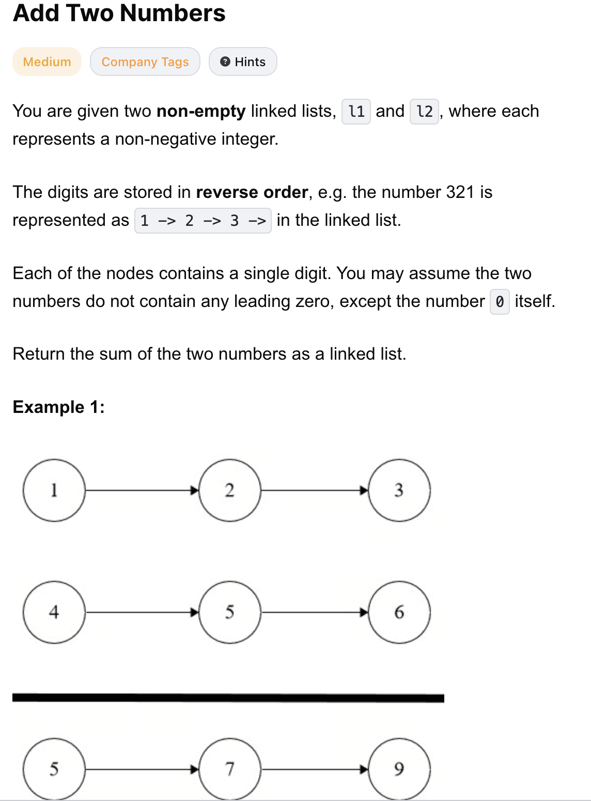
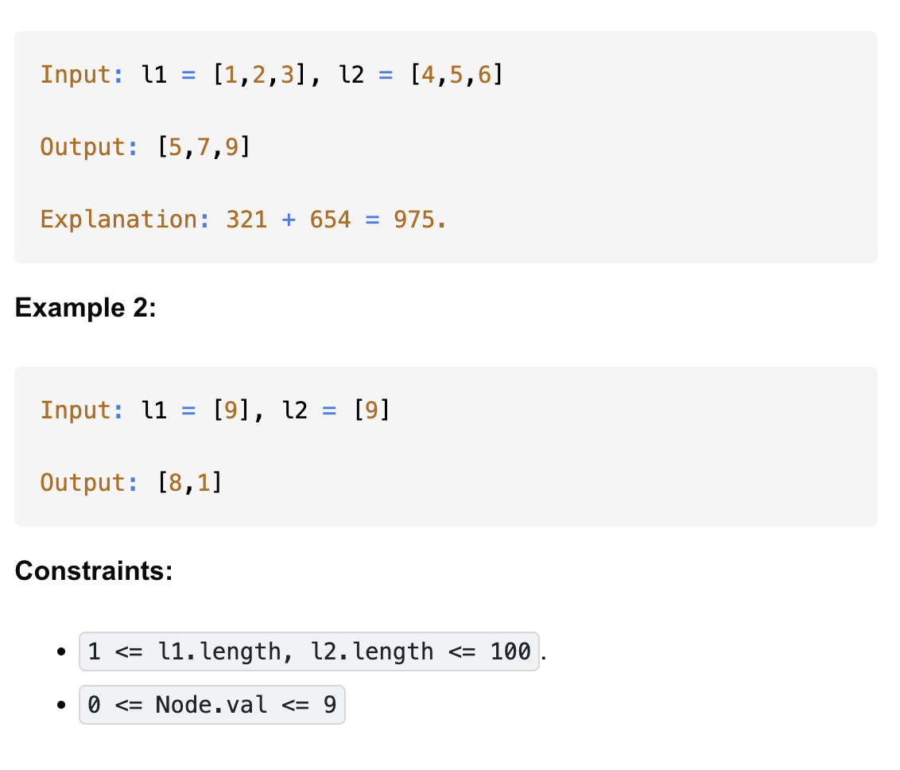

# 2-Add Two Numbers-M

## 题目描述



题意：
- 给定两个非空的链表l1 和 l2
  - 表示两个非负整数。数字按逆序存储，每个节点只存储一位数字。
- 将两个数相加，并以相同形式返回一个表示和的链表。
- 可以假设这两个数都不会以0开头，除了数字0之外
- 0 <= Node.val <= 9
- l1 和 l2长度可以不相等

解法：
- Iteration
- Recursion

## 1. Iteration
```python
# Definition for singly-linked list.
# class ListNode:
#     def __init__(self, val=0, next=None):
#         self.val = val
#         self.next = next

class Solution:
    def addTwoNumbers(self, l1: Optional[ListNode], l2: Optional[ListNode]) -> Optional[ListNode]:
        dummy = ListNode()
        cur = dummy

        carry = 0
        while l1 or l2 or carry:
            v1 = l1.val if l1 else 0
            v2 = l2.val if l2 else 0

            # new digit
            val = v1 + v2 + carry
            carry = val // 10
            val = val % 10
            cur.next = ListNode(val)

            # update ptrs
            cur = cur.next
            l1 = l1.next if l1 else None
            l2 = l2.next if l2 else None

        return dummy.next
```

- TC: O(max(m, n)))
- SC: O(max(m, n))) for the output list
- m = len(l1), n = len(l2)

- 两个链表左边都是低位，所以可以直接从头开始相加
- 在相加过程中要考虑进位carry就行