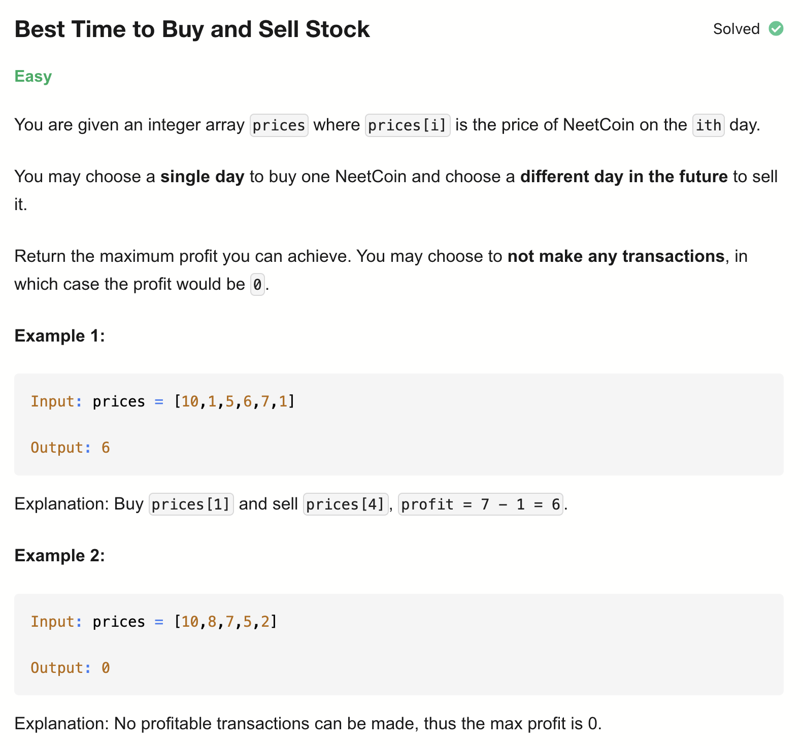
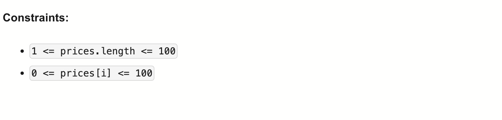

# 121-Best Time to Buy and Sell Stock-E

## 题目描述



题意：
- prices[i]是股票每天的价格，选一天买入，选一天卖出，要求差值最大
- 可以不操作，那么结果收益就是0


解法：
- Two Pointers
- Dynamic Programming

## 1. Two Pointers
```python
class Solution:
    def maxProfit(self, prices: List[int]) -> int:
        l, r = 0, 1
        maxP = 0

        while r < len(prices):
            if prices[l] < prices[r]:
                profit = prices[r] - prices[l]
                maxP = max(maxP, profit)
            else:
                l = r
            r += 1
        return maxP
```

- TC: O(n)
- SC: O(1)

## 2. Dynamic Programming
```python
class Solution:
    def maxProfit(self, prices: List[int]) -> int:
        maxP = 0
        minBuy = prices[0]

        for sell in prices:
            maxP = max(maxP, sell - minBuy)
            minBuy = min(minBuy, sell)
        return maxP
```

- TC: O(n)
- SC: O(1)