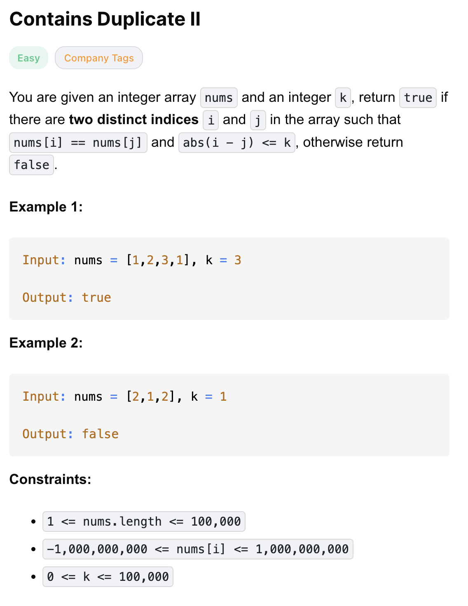

# 219-Contains Duplicate II-E

## 题目描述


题意：
- 给定一个数组 nums，一个整数k，判断nums中是否有两个相等元素，并且两个元素下标之差不超过k

解法：
- Hash Map
- Sliding Window (Hash Set)


## 1. Sliding Window (Hash Set)
```python
class Solution:
    def containsNearbyDuplicate(self, nums: List[int], k: int) -> bool:
        window = set()
        L = 0

        for R in range(len(nums)):
            if R - L > k:
                window.remove(nums[L])
                L += 1
            if nums[R] in window:
                return True
            window.add(nums[R])

        return False
```

- TC: O(n)
- SC: O(min(n, k))

分析：
- 窗口window定义为set(), 这样好判断重复元素
  - 当l, r之差大于k时，收缩左边界；不然就一直扩大右边界，直至遇到重复元素