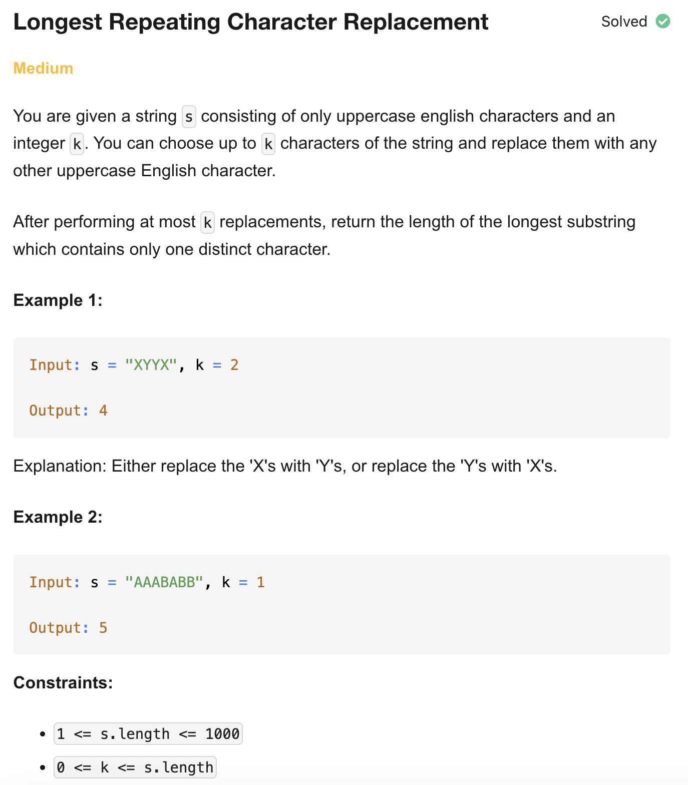

# 424-Longest Repeating Character Replacement-M

## 题目描述


题意：
- 给定一个字符串s, s只包含大写字母. 和一个整数 k
- 可以将s中的k个字母替换成任意大写字母
- 求在替换后，s中最长的只含一个字符的子串的长度

解法：
- Sliding Window

## 1. Sliding Window (Optimal)
```python
class Solution:
    def characterReplacement(self, s: str, k: int) -> int:
        count = {}
        res = 0

        l = 0
        maxf = 0 # 假设替换后剩下A，maxf记录的是非A的数量
        for r in range(len(s)):
            count[s[r]] = 1 + count.get(s[r], 0)
            maxf = max(maxf, count[s[r]])

            while (r - l + 1) - maxf > k:
                count[s[l]] -= 1
                l += 1
            res = max(res, r - l + 1)

        return res
```

- TC: O(n)
- SC: O(1) (因为只有26个大写字母)