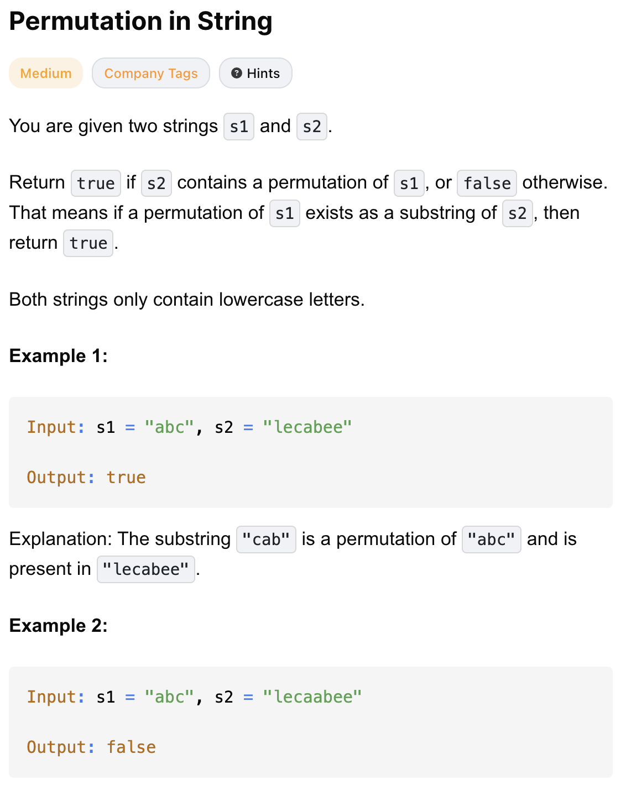

# 567-Permutation in String-M
Permutation: 排列；置换

## 题目描述


题意：
- 两个字符串s1 和 s2，问将 s1 内字符颠倒顺序后是否存在于 s2 中(为子串)

解法：
- sliding window

## 1. sliding window
```python
class Solution:
    def checkInclusion(self, s1: str, s2: str) -> bool:
        if len(s1) > len(s2):
            return False
        
        # 初始化，只统计s1的长度个字符
        s1Count, s2Count = [0] * 26, [0] * 26
        for i in range(len(s1)):
            s1Count[ord(s1[i]) - ord('a')] += 1
            s2Count[ord(s2[i]) - ord('a')] += 1

        matches = 0
        for i in range(26): # 注意这里是26
            matches += (1 if s1Count[i] == s2Count[i] else 0)

        l = 0 # l是左边界，即将移出的字符
        for r in range(len(s1), len(s2)): # r 是右边界，新加入的字符：从s2的第len(s1)开始
            if matches == 26:
                return True

            index = ord(s2[r]) - ord('a')
            s2Count[index] += 1
            if s1Count[index] == s2Count[index]:
                matches += 1
            elif s1Count[index] + 1 == s2Count[index]: # 在加入s2[r]前，s1Count[index] == s2Count[index]
                matches -= 1 # 加了s2[r]后不再匹配，所以减1

            index = ord(s2[l]) - ord('a')
            s2Count[index] -= 1
            if s1Count[index] == s2Count[index]:
                matches += 1
            elif s1Count[index] - 1 == s2Count[index]:
                matches -= 1
            l += 1
        return matches == 26
```

- TC: O(n)
- SC: O(1)