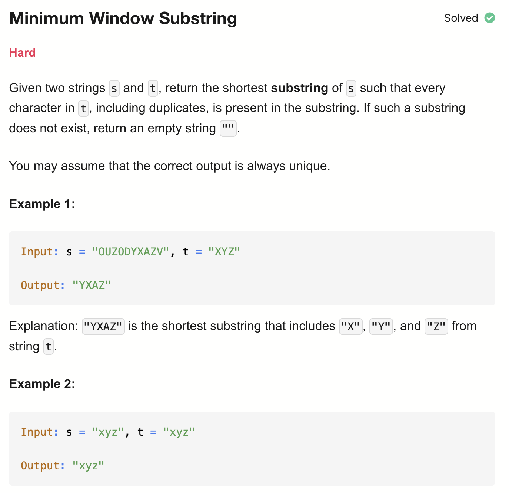
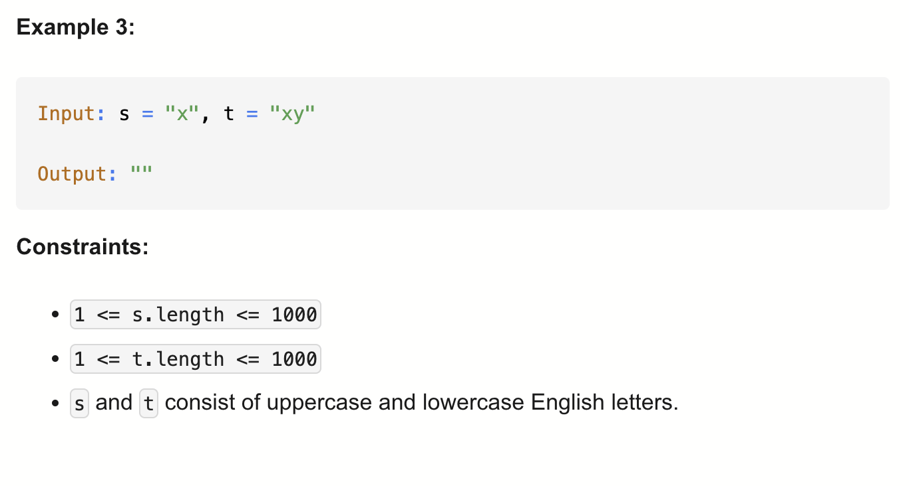

# 76-Minimum Window Substring-H

## 题目描述



题意：
- 给定两个字符串 s 和 t，返回s里能包含t的子串，若不存在，则返回空字符串

解法：
- Sorting

## 1. Brute Force
```python
class Solution:
    def minWindow(self, s: str, t: str) -> str:
        if t == "":
            return ""

        countT = {}
        for c in t:
            countT[c] = 1 + countT.get(c, 0)

        res, resLen = [-1, -1], float("infinity")
        for i in range(len(s)):
            countS = {}
            for j in range(i, len(s)):
                countS[s[j]] = 1 + countS.get(s[j], 0)

                flag = True
                for c in countT:
                    if countT[c] > countS.get(c, 0):
                        flag = False
                        break

                if flag and (j - i + 1) < resLen:
                    resLen = j - i + 1
                    res = [i, j]

        l, r = res
        return s[l : r + 1] if resLen != float("infinity") else ""
```

- TC: O(n^2 * m)
- SC: O(m)
- n是s的长度，m是s和t中的unique字符数


## 2. Sliding Window
```python
class Solution:
    def minWindow(self, s: str, t: str) -> str:
        if t == "":
            return ""

        countT, window = {}, {}
        for c in t:
            countT[c] = 1 + countT.get(c, 0)

        have, need = 0, len(countT) # 注意这里是len(countT) 而非 len(t)
        res, resLen = [-1, -1], float("infinity") # res是最终结果的在s里的下标起点终点
        l = 0
        for r in range(len(s)):
            c = s[r]
            window[c] = 1 + window.get(c, 0) # r加入window

            if c in countT and window[c] == countT[c]: # 注意要有c in countT的判断
                have += 1

            while have == need:
                if (r - l + 1) < resLen:
                    res = [l, r]
                    resLen = r - l + 1

                window[s[l]] -= 1
                if s[l] in countT and window[s[l]] < countT[s[l]]: # 注意要有in countT的判断； window[s[l]] < countT[s[l]]等价于count_t[s[l]] - 1 == window[s[l]]
                    have -= 1
                l += 1
        l, r = res # 这一行很关键，最终返回的是存在res里的下标，而非代码运行到最后的l和r值
        return s[l : r + 1] if resLen != float("infinity") else ""
```

- TC: O(n + m)
  - for r的遍历: O(n)
  - for t的计数: O(m)
- SC: O(m)
  - countT, window
- n = len(s), m = len(t)

- Q: 为什么l的更新是放在while have == need:里的?
- A: 
  - 是为了在“窗口已经满足条件时，尽可能收缩左边界，找最短的合法窗口”
  - 在不满足要求的前提下移动l没意义
  - 并且因为要不断保持窗口仍然合法，所以是while不是if
