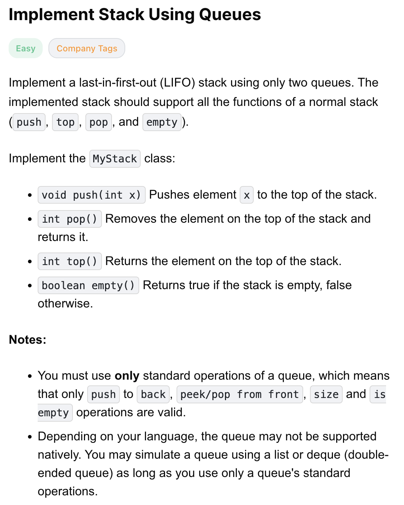
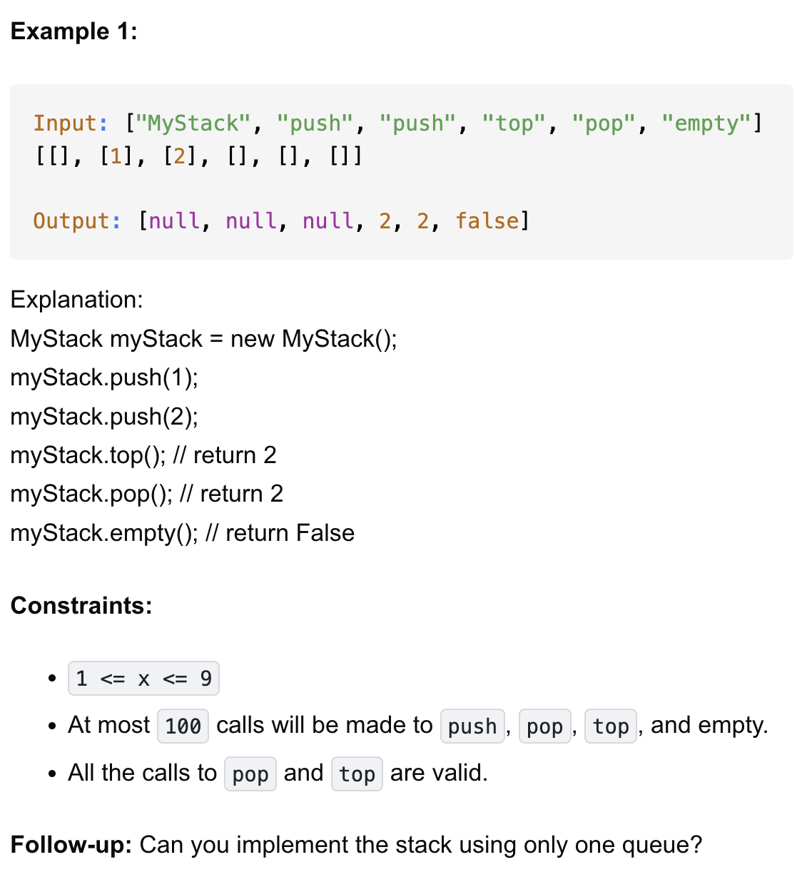

# 225-Implement Stack Using Queues-E

## 题目描述



题意：
- 用两个queue实现stack，要实现的方法有push, top, pop, and empty


解法：
- 

## 1. stack and queue
```python
class MyStack:

    def __init__(self):
        self.q1 = deque()
        self.q2 = deque()

    def push(self, x: int) -> None:
        self.q2.append(x)
        while self.q1:
            self.q2.append(self.q1.popleft())

        self.q1, self.q2 = self.q2, self.q1

    def pop(self) -> int:
        return self.q1.popleft()

    def top(self) -> int:
        return self.q1[0] # 队首元素的访问直接用下标0

    def empty(self) -> bool:
        return len(self.q1) == 0
```

- TC: 
  - init, pop, top, empty: O(1)
  - push: O(n)
- SC: O(n)

- 初始化用deque
- q1 输出， q2 输入
  - 输入的时候需要在输入x后，将q1的值倒入q2中，然后交换q1、q2。保证push方法调用后，q2是空的