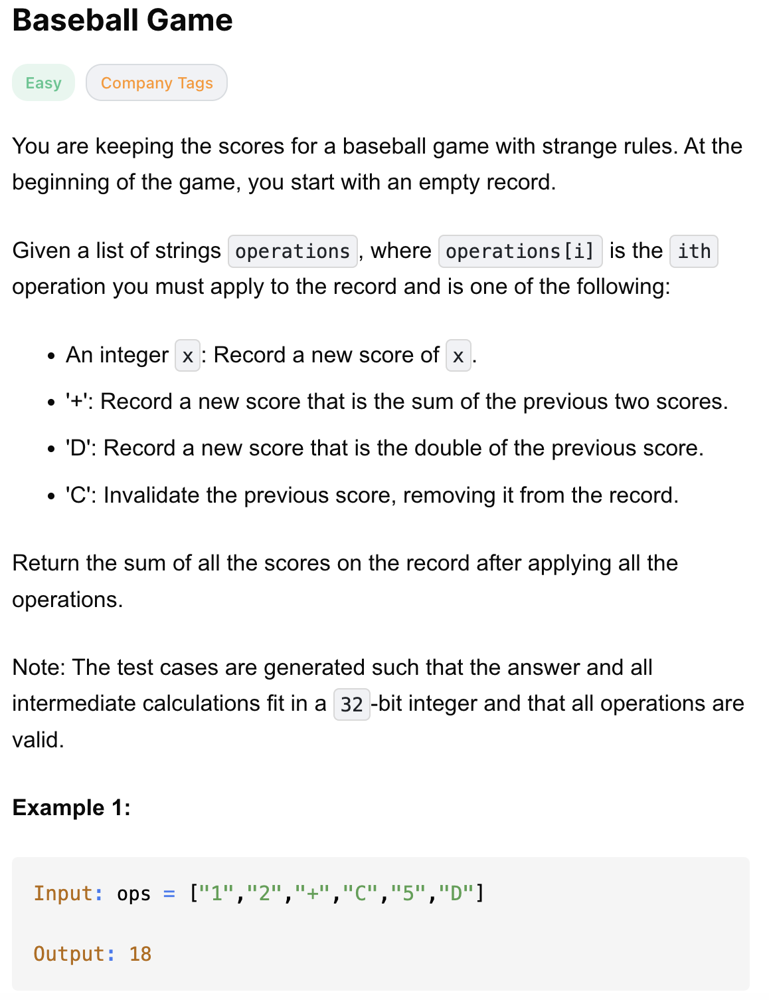
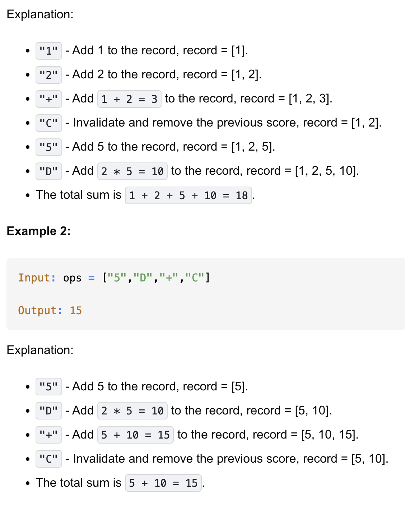
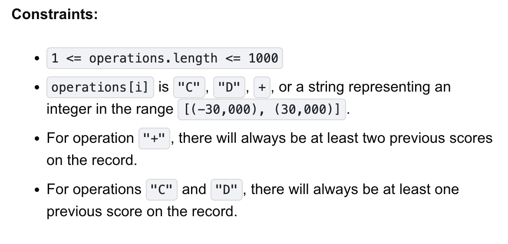

# 682-Baseball Game-E


## 题目描述





题意：
- ops是一个操作数组，按照题目意思有4种操作加到stack里：append，加，pop，乘以两倍后append
- 最终返回stack里数的sum

解法：
- stack

## 1. stack
```python
class Solution:
    def calPoints(self, operations: List[str]) -> int:
        stack = []
        for op in operations:
            if op == "+":
                stack.append(stack[-1] + stack[-2])
            elif op == "D":
                stack.append(2 * stack[-1])
            elif op == "C":
                stack.pop()
            else:
                stack.append(int(op))
        return sum(stack)
```

- TC: O(n)
- SC: O(n)