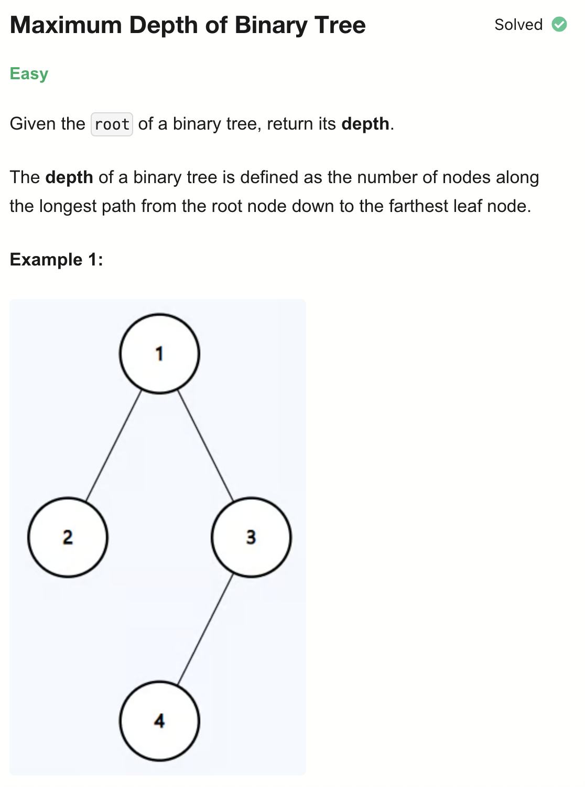
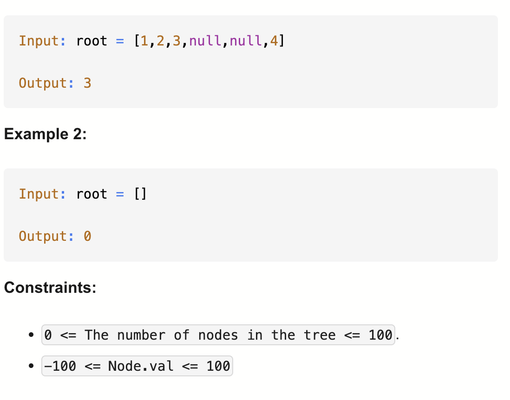

# 104-Maximum Depth of Binary Tree-E

## 题目描述



题意：
- 给定一个树的根节点，返回其depth
- depth是根节点到叶子节点的最远距离，从1开始

解法：
- dfs
- bfs


## 1. Recursive DFS
```python
# Definition for a binary tree node.
# class TreeNode:
#     def __init__(self, val=0, left=None, right=None):
#         self.val = val
#         self.left = left
#         self.right = right

class Solution:
    def maxDepth(self, root: Optional[TreeNode]) -> int:
        if not root:
            return 0

        return 1 + max(self.maxDepth(root.left), self.maxDepth(root.right))
```

- TC: O(n)
- SC: O(h)
  - Best Case (balanced tree): O(log n)
  - Worst Case (degenerate tree): O(n)


## 2. Iterative DFS (Stack)
```python
# Definition for a binary tree node.
# class TreeNode:
#     def __init__(self, val=0, left=None, right=None):
#         self.val = val
#         self.left = left
#         self.right = right

class Solution:
    def maxDepth(self, root: Optional[TreeNode]) -> int:
        stack = [[root, 1]]
        res = 0

        while stack:
            node, depth = stack.pop()

            if node:
                res = max(res, depth)
                stack.append([node.left, depth + 1])
                stack.append([node.right, depth + 1])
        return res
```

- TC: O(n)
- SC: O(n)


## 3. Breadth First Search
```python
# Definition for a binary tree node.
# class TreeNode:
#     def __init__(self, val=0, left=None, right=None):
#         self.val = val
#         self.left = left
#         self.right = right

class Solution:
    def maxDepth(self, root: Optional[TreeNode]) -> int:
        q = deque()
        if root:
            q.append(root)

        level = 0
        while q:
            for i in range(len(q)):
                node = q.popleft()
                if node.left:
                    q.append(node.left)
                if node.right:
                    q.append(node.right)
            level += 1
        return level
```

- TC: O(n)
- SC: O(n)

