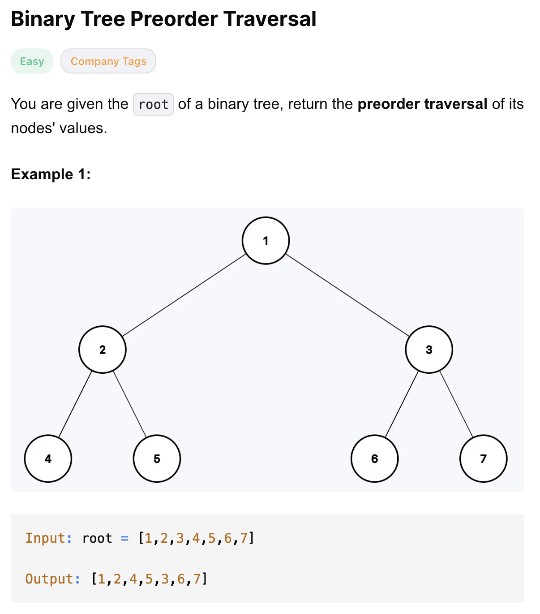
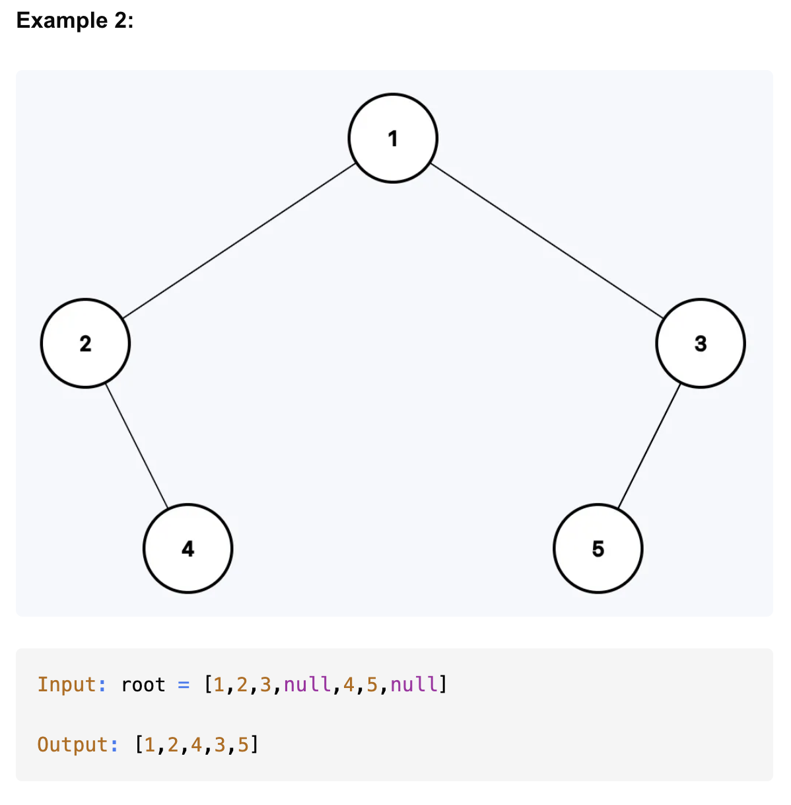
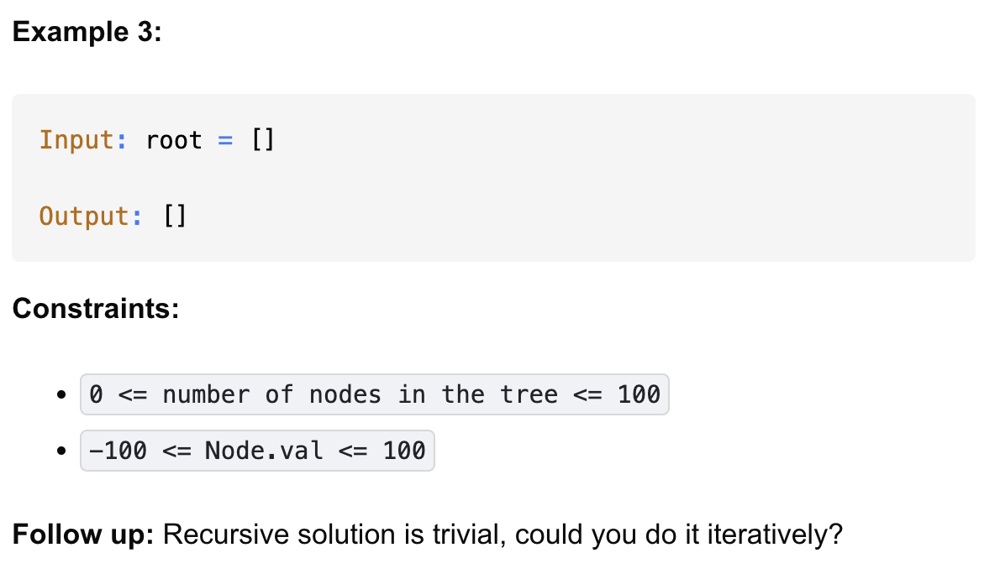

# 144-Binary Tree Preorder Traversal-E


## 题目描述





题意：
- 给一个二叉树的root节点，前序遍历这棵树，遍历时将值加入数组，最终返回数组
  - 根 左 右

解法：
- dfs
- Iterative dfs
- Morris Traversal

## 1. Depth First Search
```python
# Definition for a binary tree node.
# class TreeNode:
#     def __init__(self, val=0, left=None, right=None):
#         self.val = val
#         self.left = left
#         self.right = right
class Solution:
    def preorderTraversal(self, root: Optional[TreeNode]) -> List[int]:
        res = []

        def preorder(node):
            if not node:
                return

            res.append(node.val)
            preorder(node.left)
            preorder(node.right)

        preorder(root)
        return res
```

- TC: O(n)
- SC: O(n)
  - 递归栈、输出数组

## 2. Iterative Depth First Search
```python
# Definition for a binary tree node.
# class TreeNode:
#     def __init__(self, val=0, left=None, right=None):
#         self.val = val
#         self.left = left
#         self.right = right
class Solution:
    def preorderTraversal(self, root: Optional[TreeNode]) -> List[int]:
        res = []
        stack = []
        cur = root

        while cur or stack:
            if cur:
                res.append(cur.val)
                stack.append(cur.right) # 注意这里是right，因为要先访问左，右就先存着
                cur = cur.left
            else:
                cur = stack.pop() # 后存的先出来

        return res
```

- TC: O(n)
- SC: O(n)
  - 栈、输出数组