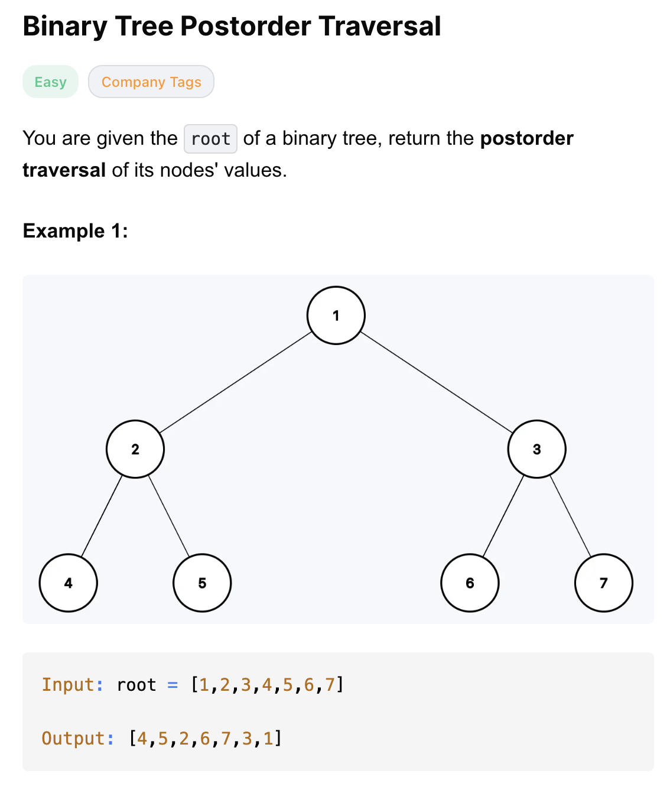
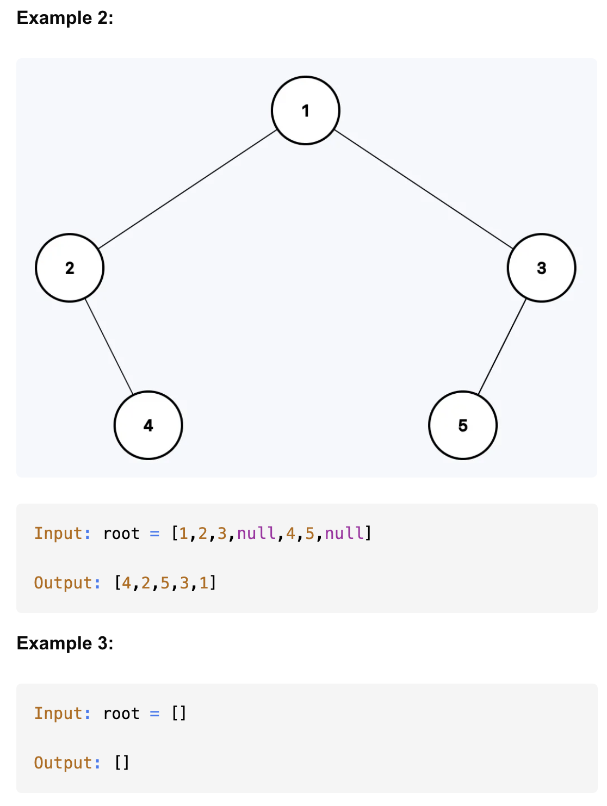
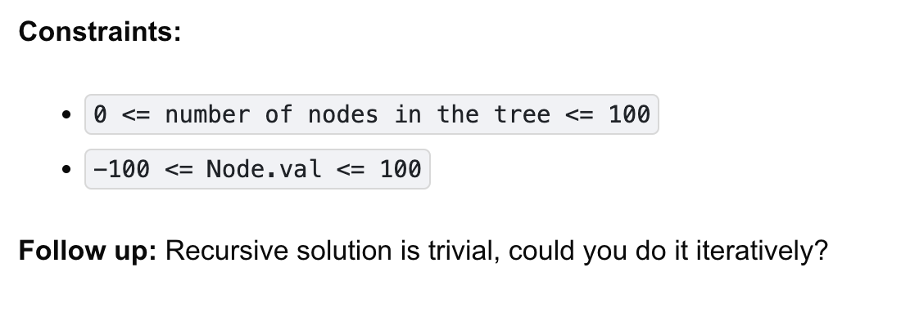

# 145-Binary Tree Postorder Traversal-E

## 题目描述




题意：
- 给一个二叉树的root节点，**后**序遍历这棵树，遍历时将值加入数组，最终返回数组
  - 左 右 根

解法：
- dfs
- Iterative Depth First Search
- Morris Traversal

## 1. dfs
```python
# Definition for a binary tree node.
# class TreeNode:
#     def __init__(self, val=0, left=None, right=None):
#         self.val = val
#         self.left = left
#         self.right = right
class Solution:
    def postorderTraversal(self, root: Optional[TreeNode]) -> List[int]:
        res = []

        def postorder(node):
            if not node:
                return

            postorder(node.left)
            postorder(node.right)
            res.append(node.val)

        postorder(root)
        return res
```

- TC: O(n)
- SC: O(n)

## 2.Iterative Depth First Search
```python
# Definition for a binary tree node.
# class TreeNode:
#     def __init__(self, val=0, left=None, right=None):
#         self.val = val
#         self.left = left
#         self.right = right
class Solution:
    def postorderTraversal(self, root: Optional[TreeNode]) -> List[int]:
        res = []
        stack = []
        cur = root

        while cur or stack:
            if cur:
                res.append(cur.val)
                stack.append(cur) # 别忘了
                cur = cur.right
            else:
                cur = stack.pop()
                cur = cur.left # 因为上一轮的cur右边为空了才走到这个分支，所以接下来往left走

        res.reverse()
        return res
```

- TC: O(n)
- SC: O(n)

分析：
res放入的顺序是 根 右 左，所以最后需要reverse
因为先访问的右，所以在cur不为空的分支里，一直向right访问