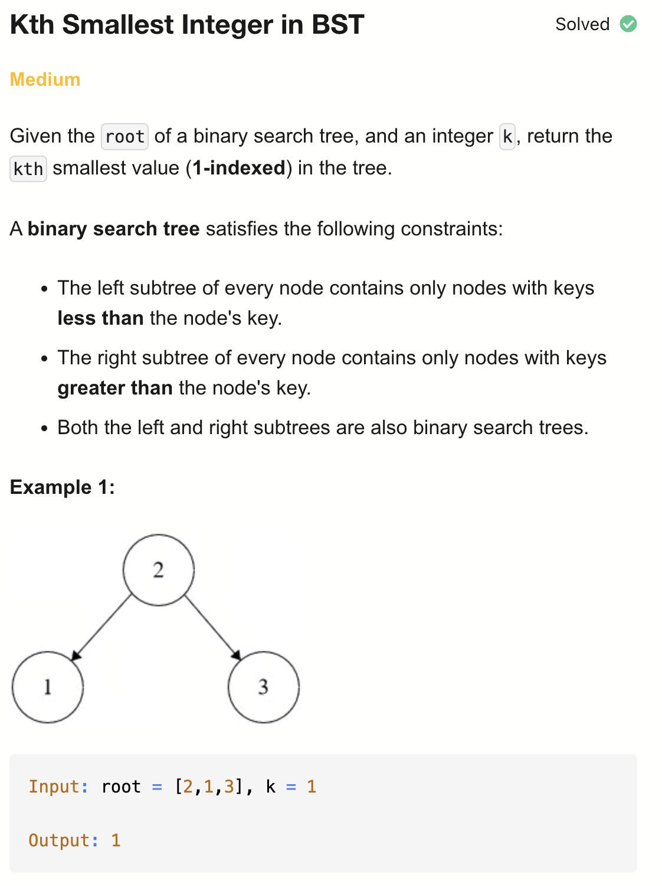
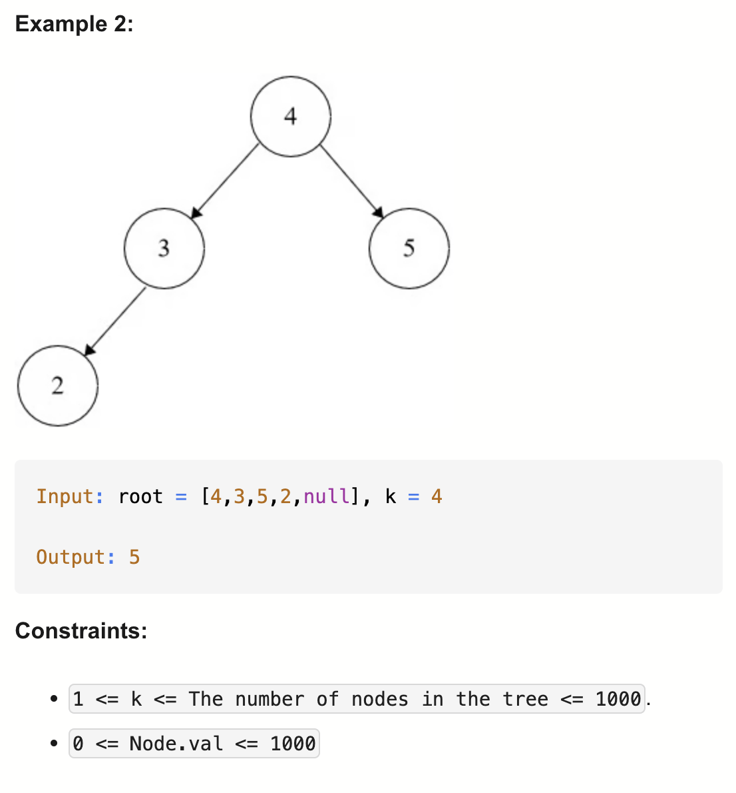

# 230-Kth Smallest Integer in BST-M

## 题目描述



题意：
- 给定一个二叉搜索树，返回第k小的值

解法：
- Inorder Traversal
- Recursive DFS
- Iterative DFS

## 1. Inorder Traversal
```python
# Definition for a binary tree node.
# class TreeNode:
#     def __init__(self, val=0, left=None, right=None):
#         self.val = val
#         self.left = left
#         self.right = right

class Solution:
    def kthSmallest(self, root: Optional[TreeNode], k: int) -> int:
        arr = []

        def dfs(node):
            if not node:
                return

            dfs(node.left)
            arr.append(node.val)
            dfs(node.right)

        dfs(root)
        return arr[k - 1]
```

- TC: O(n)
- SC: O(n)

## 2. Recursive DFS
```python
# Definition for a binary tree node.
# class TreeNode:
#     def __init__(self, val=0, left=None, right=None):
#         self.val = val
#         self.left = left
#         self.right = right

class Solution:
    def kthSmallest(self, root: Optional[TreeNode], k: int) -> int:
        cnt = k
        res = root.val

        def dfs(node):
            nonlocal cnt, res
            if not node:
                return

            dfs(node.left)
            cnt -= 1
            if cnt == 0:
                res = node.val
                return
            dfs(node.right)

        dfs(root)
        return res
```

- TC: O(n)
- SC: O(n)

## 3. Iterative DFS
```python
# Definition for a binary tree node.
# class TreeNode:
#     def __init__(self, val=0, left=None, right=None):
#         self.val = val
#         self.left = left
#         self.right = right

class Solution:
    def kthSmallest(self, root: Optional[TreeNode], k: int) -> int:
        stack = []
        curr = root

        while stack or curr:
            while curr:
                stack.append(curr)
                curr = curr.left
            curr = stack.pop()
            k -= 1
            if k == 0:
                return curr.val
            curr = curr.right
```
- TC: O(n)
- SC: O(n)