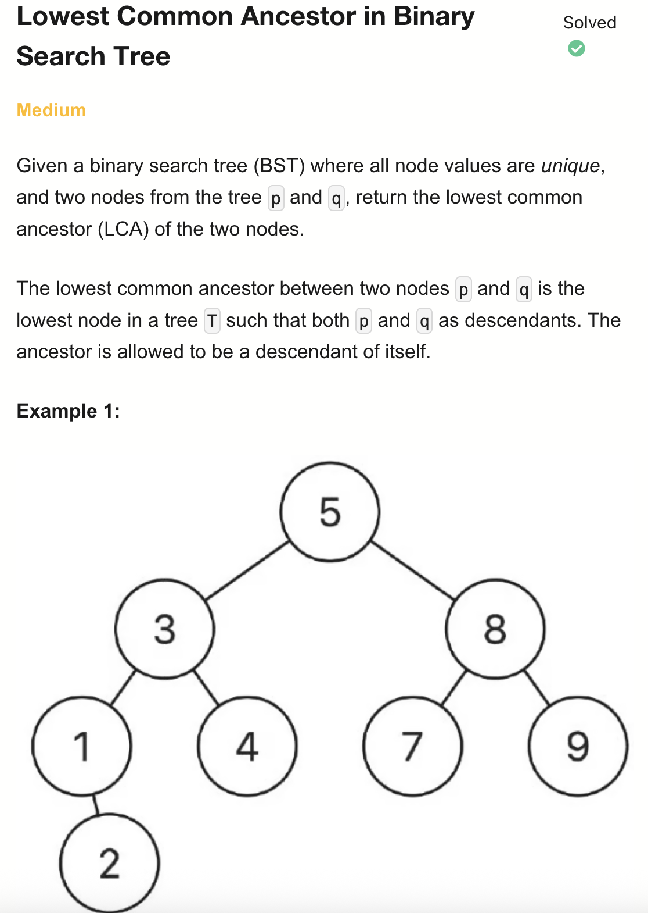
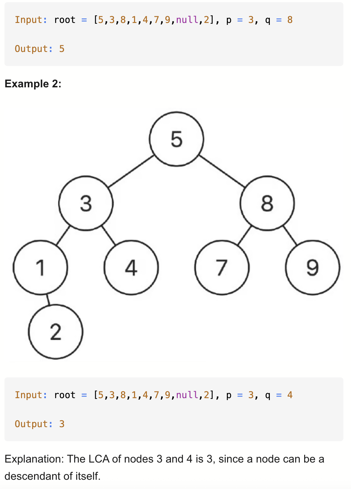
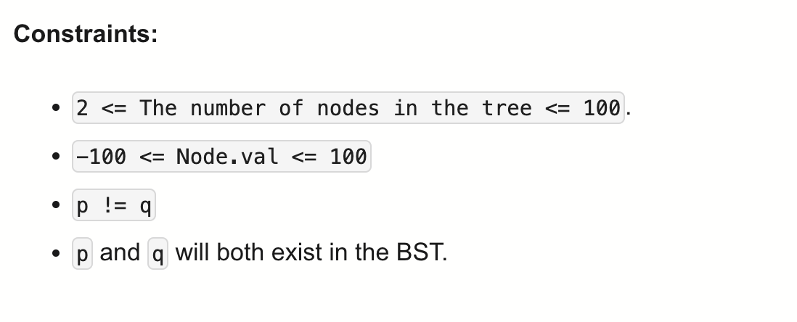

# 235-Lowest Common Ancestor in Binary Search Tree-M

## 题目描述




题意:
- 二叉搜索树中的最近公共祖先
  - 二叉搜索树：本身及所有子树满足 左 < 根 < 右
  - 给一棵树以及两个节点，求这俩节点最近公共祖先
    - 若俩节点都 **>** 当前节点，说明俩节点的最近公共祖先 在 当前节点的**右**边
    - 若俩节点都 **<** 当前节点，说明俩节点的最近公共祖先 在 当前节点的**左**边
    - 否则，就是当前节点

解法：
- Recursion
- Iteration

## 1. Recursion
```python
# Definition for a binary tree node.
# class TreeNode:
#     def __init__(self, val=0, left=None, right=None):
#         self.val = val
#         self.left = left
#         self.right = right

class Solution:
    def lowestCommonAncestor(self, root: TreeNode, p: TreeNode, q: TreeNode) -> TreeNode:
        if not root or not p or not q: # 递归边界，有一个节点为空
            return None
        if (max(p.val, q.val) < root.val):
            return self.lowestCommonAncestor(root.left, p, q)
        elif (min(p.val, q.val) > root.val):
            return self.lowestCommonAncestor(root.right, p, q)
        else:
            return root
```

- TC: O(h)
- SC: O(h) 递归栈
- Where h is the height of the tree.

## 2. Iteration
```python
# Definition for a binary tree node.
# class TreeNode:
#     def __init__(self, val=0, left=None, right=None):
#         self.val = val
#         self.left = left
#         self.right = right

class Solution:
    def lowestCommonAncestor(self, root: TreeNode, p: TreeNode, q: TreeNode) -> TreeNode:
        cur = root

        while cur:
            if p.val > cur.val and q.val > cur.val:
                cur = cur.right
            elif p.val < cur.val and q.val < cur.val:
                cur = cur.left
            else:
                return cur 
```

- TC: O(h)
- SC: O(1)
- Where h is the height of the tree.

注意：
- 要在else分支里return了
  - 不能写成cur = root然后循环外return，这样导致cur不为空，死循环
- elif不能写成if
  - 因为在 Python 中，else 只和它最近的 if 绑定，而不是和上面的 if
  - else是排除了两种情况的第三个分支。而仅排除第二个if的分支