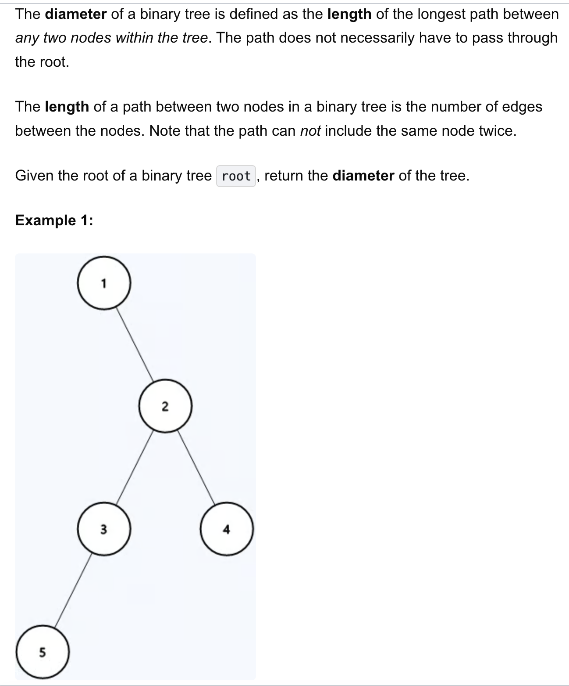
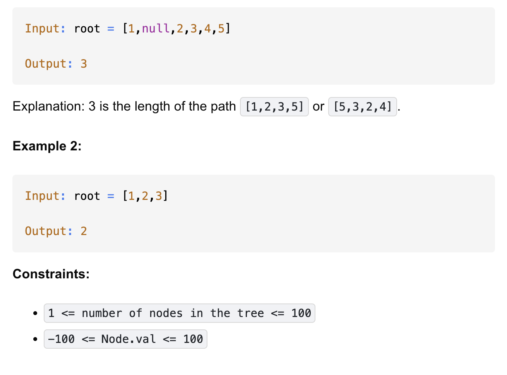

# 543-Diameter of Binary Tree-E

## 题目描述



题意：
- 给定一棵二叉树，返回其直径长度
- 直径长度：任意两个节点路径长度的最大值（路径长度：边的数量）
- 注意：路径不一定经过根节点；不可经过一个节点两次
  - 路径不经过根节点还能是最长的情况：左子树很浅，但是右子树的左右都很深，那么直径就是以右子树的根节点为拐点的路径
- 本质在求左右子树高度之和的最大值

解法：
- Depth-First Search


## 1. Depth First Search
```python
# Definition for a binary tree node.
# class TreeNode:
#     def __init__(self, val=0, left=None, right=None):
#         self.val = val
#         self.left = left
#         self.right = right

class Solution:
    def diameterOfBinaryTree(self, root: Optional[TreeNode]) -> int:
        res = 0

        def dfs(root):
            nonlocal res

            if not root:
                return 0
            left = dfs(root.left)
            right = dfs(root.right)
            res = max(res, left + right)

            return 1 + max(left, right)

        dfs(root)
        return res
```

- TC: O(n)
- SC: O(h)
- n = number of nodes, h = height of the tree

- dfs求的是左/右子树高度
- res记录的是直径的最大值，即左右子树高度之和的最大值