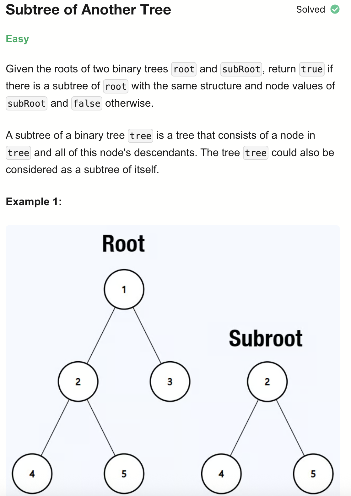
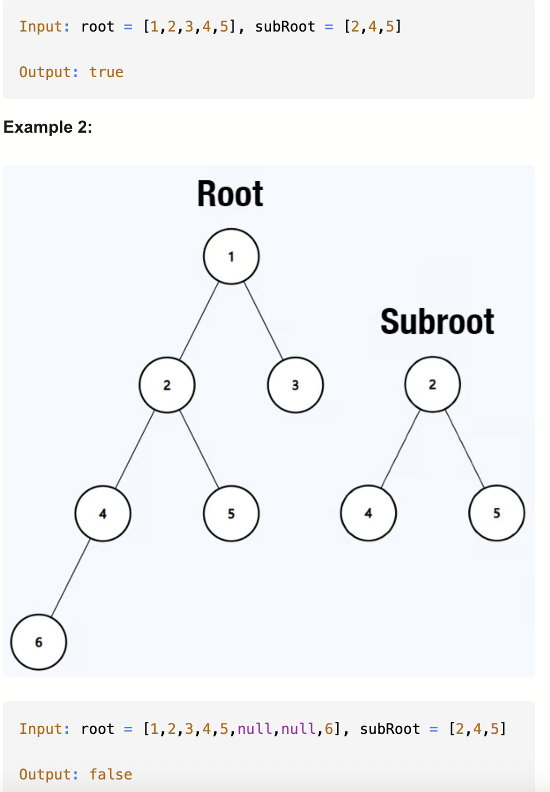
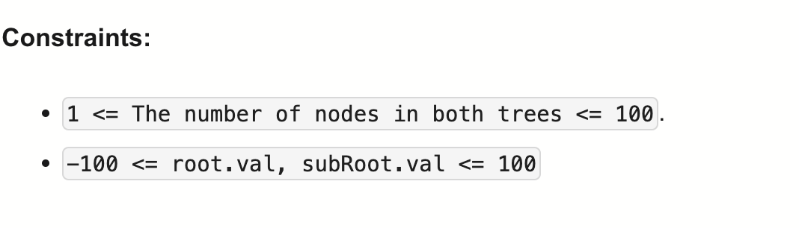

# 572-Subtree of Another Tree-E

## 题目描述




题意：
- 给两个树A、B的root节点，判断B是否为A的子树。
- A是A的子树

解法：
- dfs
- bfs

## 1. dfs

```python
# Definition for a binary tree node.
# class TreeNode:
#     def __init__(self, val=0, left=None, right=None):
#         self.val = val
#         self.left = left
#         self.right = right

class Solution:

    def isSubtree(self, root: Optional[TreeNode], subRoot: Optional[TreeNode]) -> bool:
        if not subRoot:
            return True
        if not root:
            return False

        if self.sameTree(root, subRoot):
            return True
        return (self.isSubtree(root.left, subRoot) or
               self.isSubtree(root.right, subRoot))

    def sameTree(self, root: Optional[TreeNode], subRoot: Optional[TreeNode]) -> bool:
        if not root and not subRoot:
            return True
        if root and subRoot and root.val == subRoot.val:
            return (self.sameTree(root.left, subRoot.left) and
                   self.sameTree(root.right, subRoot.right))
        return False
```
- 
- TC: O(m * n)
  - 外层递归 isSubtree，会 遍历 root 的每一个节点，所以外层是 O(n)
  - 内层递归 sameTree，sameTree 会递归比较两棵树的 所有节点，在最坏情况下，需要比较 subRoot 的 m 个节点，单次 sameTree 是 O(m)
- SC: O(m + n)
  - 两个方法的递归深度分别是O(n)、O(m)
- m为subRoot节点数，n为Root节点数

## 2. bfs

```python
# Definition for a binary tree node.
# class TreeNode:
#     def __init__(self, val=0, left=None, right=None):
#         self.val = val
#         self.left = left
#         self.right = right

class Solution:   
    def isSameTree(self, p: Optional[TreeNode], q: Optional[TreeNode]) -> bool:
        if p is None and q is None:
            return True
        if p is None or q is None:
            return False
        if p.val != q.val:
            return False
        return self.isSameTree(p.left, q.left) and self.isSameTree(p.right, q.right)

    def isSubtree(self, root: Optional[TreeNode], subRoot: Optional[TreeNode]) -> bool:
        if root is None:
            return False if subRoot else True
        q = deque([root])
        while q:
            for _ in range(len(q)):
                node = q.popleft()
                if node.val == subRoot.val and self.isSameTree(node, subRoot):
                    return True
                if node.left:
                    q.append(node.left)
                if node.right:
                    q.append(node.right)
        return False
```

复杂度同上：
- TC: O(m * n)
- SC: O(m + n)
- m为subRoot节点数，n为Root节点数