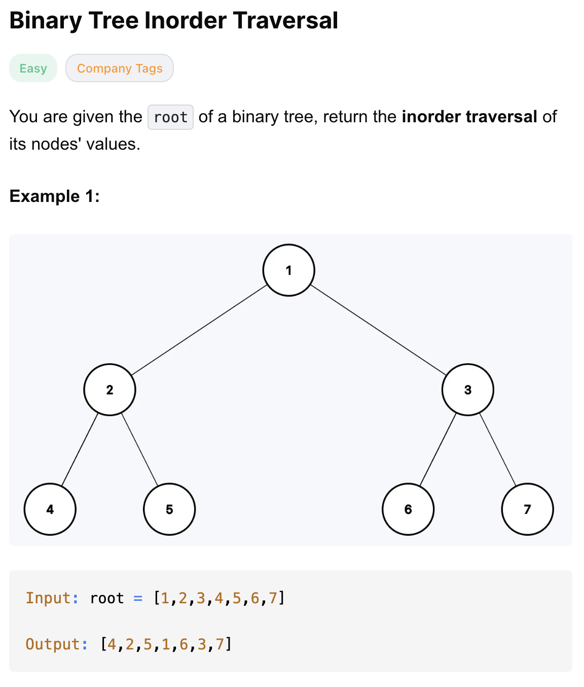
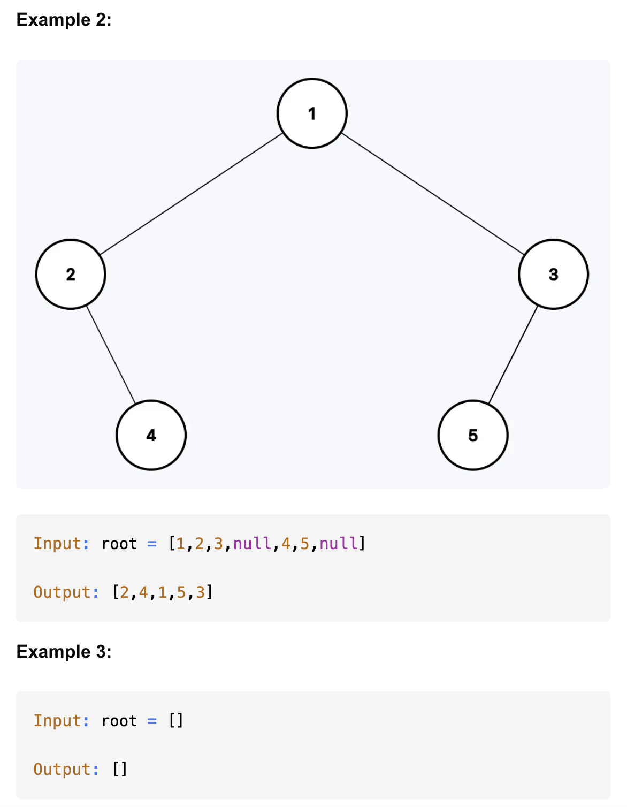

# 94-Binary Tree Inorder Traversal-E

## 题目描述




题意：
- 给一个二叉树的root节点，中序遍历这棵树，遍历时将值加入数组，最终返回数组
  - 左 根 右

解法：
- dfs
- Iterative dfs
- Morris Traversal

## 1. dfs
```python
# Definition for a binary tree node.
# class TreeNode:
#     def __init__(self, val=0, left=None, right=None):
#         self.val = val
#         self.left = left
#         self.right = right
class Solution:
    def inorderTraversal(self, root: Optional[TreeNode]) -> List[int]:
        res = []

        def inorder(node):
            if not node:
                return

            inorder(node.left)
            res.append(node.val)
            inorder(node.right)

        inorder(root)
        return res
```

- TC: O(n)
- SC: O(n)
  - 递归栈、输出数组
