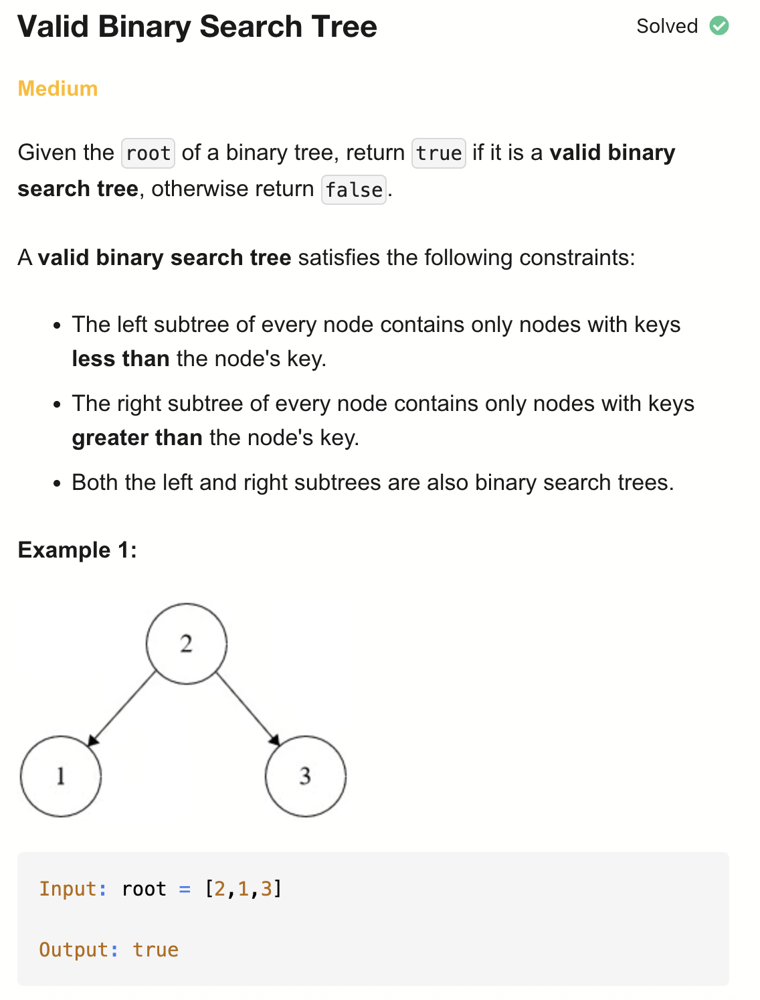
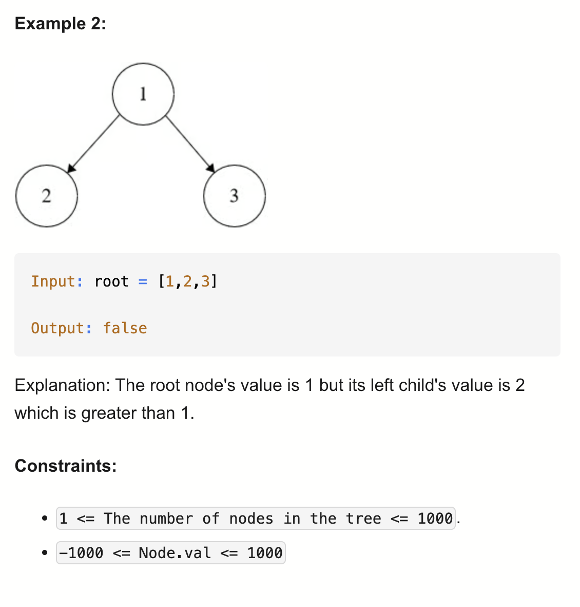

# 98-Valid Binary Search Tree-M

## 题目描述



题意：
- 给定一个二叉树，判断其是否为有效的二叉搜索树（BST），返回bool
- BST 定义：
  - 节点的左子树只包含小于当前节点的数
  - 节点的右子树只包含大于当前节点的数
  - 所有左子树和右子树自身必须也是二叉搜索树

解法：
- dfs
- bfs

## 1. DFS
```python
# Definition for a binary tree node.
# class TreeNode:
#     def __init__(self, val=0, left=None, right=None):
#         self.val = val
#         self.left = left
#         self.right = right

class Solution:
    def isValidBST(self, root: Optional[TreeNode]) -> bool:
        def valid(node, left, right):
            if not node:
                return True
            if not (left < node.val < right):
                return False

            return valid(node.left, left, node.val) and valid(
                node.right, node.val, right
            )

        return valid(root, float("-inf"), float("inf"))
```

- TC: O(n)
- SC: O(n) 递归栈空间

或者也可以 中序遍历，判断得到的是否为递增序列

## 2. BFS
```python
# Definition for a binary tree node.
# class TreeNode:
#     def __init__(self, val=0, left=None, right=None):
#         self.val = val
#         self.left = left
#         self.right = right

class Solution:
    def isValidBST(self, root: Optional[TreeNode]) -> bool:
        if not root:
            return True

        q = deque([(root, float("-inf"), float("inf"))])

        while q:
            node, left, right = q.popleft()
            if not (left < node.val < right):
                return False
            if node.left:
                q.append((node.left, left, node.val))
            if node.right:
                q.append((node.right, node.val, right))

        return True
```

- TC: O(n)
- SC: O(n)