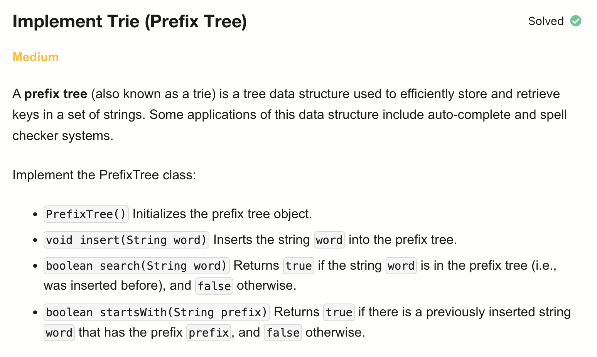
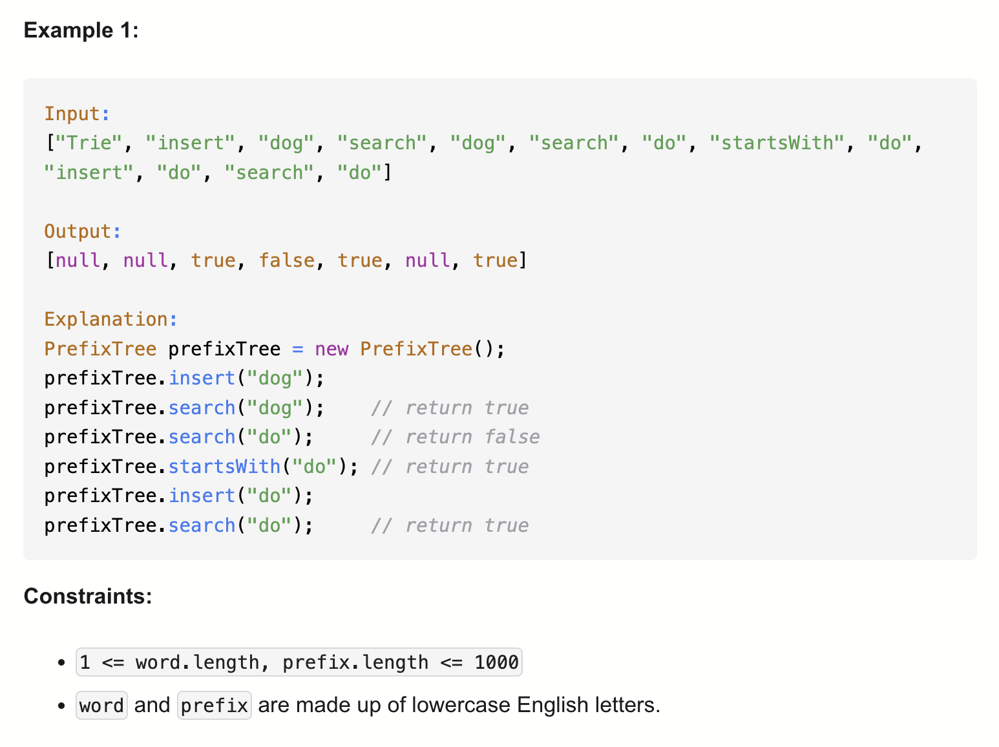

# 208-Implement Trie (Prefix Tree)-M

## 题目描述



题意：
- OOD: 实现Trie (Prefix Tree) 类，包含constructor, insert word, search word, startsWith prefix方法


解法：
- Trie (Array / Hash Map)

## 1. Prefix Tree (Array)
```python
class TrieNode:
    def __init__(self):
        self.children = [None] * 26 # 注意初始值为None，后续会更新值为TrieNode
        self.endOfWord = False

class PrefixTree:
    def __init__(self):
        self.root = TrieNode()

    def insert(self, word: str) -> None:
        cur = self.root
        for c in word:
            i = ord(c) - ord("a")
            if cur.children[i] == None:
                cur.children[i] = TrieNode()
            cur = cur.children[i]
        cur.endOfWord = True

    def search(self, word: str) -> bool:
        cur = self.root
        for c in word:
            i = ord(c) - ord("a")
            if cur.children[i] == None:
                return False
            cur = cur.children[i]
        return cur.endOfWord

    def startsWith(self, prefix: str) -> bool:
        cur = self.root
        for c in prefix:
            i = ord(c) - ord("a")
            if cur.children[i] == None:
                return False
            cur = cur.children[i]
        return True
```

- TC: O(n) for each function call.
- SC: O(t)
- n = len(word), t = num of TrieNodes created in the Trie

分析：
Trie（发音类似 “try”）是一种**树形数据结构**，专门用来存储字符串（通常是字母）。特点：
1. 每个节点代表一个字符，而每一个节点都可以有26个孩子
2. 从根到某个节点的路径代表一个前缀
3. 可以高效实现：   
    - 判断某个单词是否存在 → `search`
    - 判断是否存在某个前缀 → `startsWith`
    - 插入单词 → `insert`
    

优点：
- 可以共享公共前缀，节省空间。查找时间复杂度只和单词长度有关（O(L)，L = 单词长度）

根节点不存字符本身，只是一个入口
insert:
- 若节点为None，说明这里是空，就在字符c对应下标创建节点TrieNode()，意思上相当于插入字符c
- 若节点不为None，说明在之前加入的单词中有相同的前缀。比如之前插入过apple，现在要插入app，那么app这段都是不需要操作的

search:
- 遍历判断字符c是否在前缀树中，也就是从根节点出发判断c对应索引处是否有节点。直到判断cur.endOfWord

startsWith:
- 因为只需要判断前缀，所以跟search的区别在于不需要判断endOfWord

## 2. Prefix Tree (Hash Map)
```python
class TrieNode:
    def __init__(self):
        self.children = {}
        self.endOfWord = False

class PrefixTree:
    def __init__(self):
        self.root = TrieNode()

    def insert(self, word: str) -> None:
        cur = self.root
        for c in word:
            if c not in cur.children:
                cur.children[c] = TrieNode()
            cur = cur.children[c]
        cur.endOfWord = True

    def search(self, word: str) -> bool:
        cur = self.root
        for c in word:
            if c not in cur.children:
                return False
            cur = cur.children[c]
        return cur.endOfWord

    def startsWith(self, prefix: str) -> bool:
        cur = self.root
        for c in prefix:
            if c not in cur.children:
                return False
            cur = cur.children[c]
        return True
```

- TC: O(n) for each function call.
- SC: O(t)
- n = len(word), t = num of TrieNodes created in the Trie

把用大小为26的数组改为哈希表实现
修改两个地方：
1.在每个方法的判断c处children是否None的地方改成用not in判断
2.将原本的i改为c

