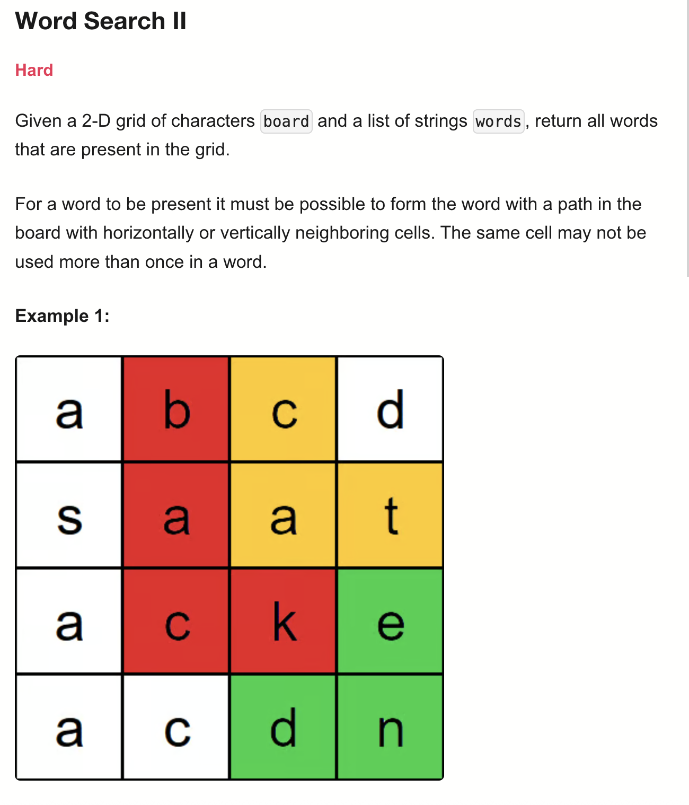
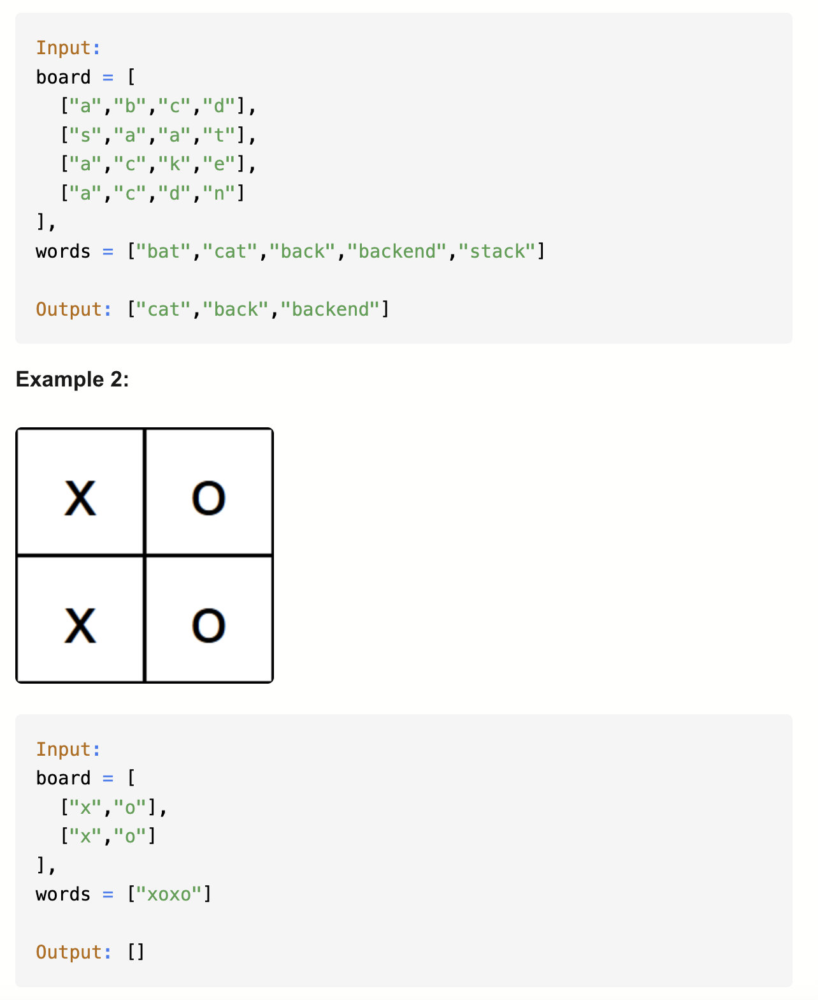
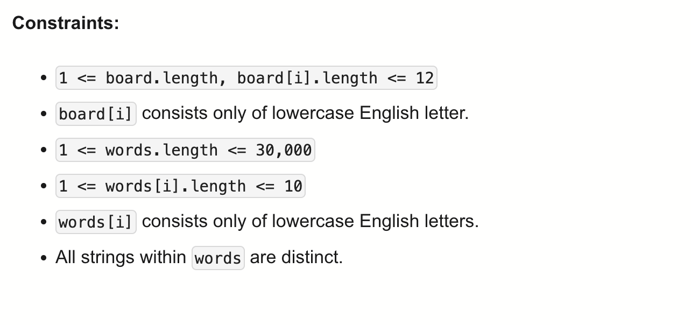

# 212-Word Search II-H

## 题目描述




题意：
- 给一个m * n的格子，元素是字符，给一个words单词列表(所有单词都是unique的)
- 在格子里找words里的单词，走向只能竖直或水平，求所有结果


解法：
- Backtracking + Trie

## 1. Backtracking
```python
class Solution:
    def findWords(self, board: List[List[str]], words: List[str]) -> List[str]:
        ROWS, COLS = len(board), len(board[0])
        res = []

        def backtrack(r, c, i):
            if i == len(word):
                return True
            if (r < 0 or c < 0 or r >= ROWS or
                c >= COLS or board[r][c] != word[i]
            ):
                return False

            board[r][c] = '*'
            ret = (backtrack(r + 1, c, i + 1) or
                   backtrack(r - 1, c, i + 1) or
                   backtrack(r, c + 1, i + 1) or
                   backtrack(r, c - 1, i + 1))
            board[r][c] = word[i]
            return ret

        for word in words:
            flag = False
            for r in range(ROWS):
                if flag:
                    break
                for c in range(COLS):
                    if board[r][c] != word[0]:
                        continue
                    if backtrack(r, c, 0):
                        res.append(word)
                        flag = True
                        break
        return res
```

这个解法在leetcode里会超时
- TC: O(N * m * 4^t) 或者再精细一点O(N * m * 3 * 4^(t-1))
- SC: O(t)

N is len(words); m is board的格子总数; t is单词长度
时间：三层循环，所以N * m；回溯树的深度t，有4种选择，所以4^t；也可以看作3 * 4^(t-1)，因为没法走回头路，所以第一步有4种选择，后面的每一步都只有3种
空间：回溯树的深度t

## 2. Backtracking (Trie + Hash Set)
```python
class TrieNode:
    def __init__(self):
        self.children = {}
        self.isWord = False

    def addWord(self, word):
        cur = self
        for c in word:
            if c not in cur.children:
                cur.children[c] = TrieNode()
            cur = cur.children[c]
        cur.isWord = True

class Solution:
    def findWords(self, board: List[List[str]], words: List[str]) -> List[str]:
        root = TrieNode()
        for w in words:
            root.addWord(w)

        ROWS, COLS = len(board), len(board[0])
        res, visit = set(), set()

        def dfs(r, c, node, word):
            if (r < 0 or c < 0 or r >= ROWS or
                c >= COLS or (r, c) in visit or
                board[r][c] not in node.children
            ):
                return

            visit.add((r, c))
            node = node.children[board[r][c]]
            word += board[r][c]
            if node.isWord:
                res.add(word)

            dfs(r + 1, c, node, word)
            dfs(r - 1, c, node, word)
            dfs(r, c + 1, node, word)
            dfs(r, c - 1, node, word)
            visit.remove((r, c))

        for r in range(ROWS):
            for c in range(COLS):
                dfs(r, c, root, "")

        return list(res)
```

- TC: O(m * 3 * 4^(t-1) + s)
- SC: O(s+t)

注意这里的res要用set()，不能直接用list
因为tries是共享前缀的，而加到res前是用node.word也就是是否到达词尾来判断的，所以不用set就可能会加入重复word
TC: O(m * 3 * 4^(t-1) + s)
SC: O(s+t)
m is board的格子总数; t is单词长度; s 是所有单词字符数
时间：比上一种少一层循环，多了构建trie的时间s
空间：trienode的空间+栈空间


## 3. Backtracking (Trie)
```python
class TrieNode:
    def __init__(self):
        self.children = [None] * 26
        # -1表示当前node非词尾
        # 非-1表示是词尾，并且这个单词在words数组的索引为idx，为了后续加入output list方便
        self.idx = -1
        self.refs = 0 # 以当前节点为根的子树中，还剩多少个有效单词
    
    def addWord(self, word, i):
        cur = self
        cur.refs += 1
        for c in word:
            index = ord(c) - ord('a')
            if not cur.children[index]: # 这就是数组和map的区别，这里不是c not in了，而是直接判断是否none
                cur.children[index] = TrieNode()
            cur = cur.children[index]
            cur.refs += 1
        cur.idx = i # idx = 这个单词在words数组的下标
        # 因为题目保证words中的元素各不相同，所以不会出现同一个trienode的idx会对应多个值的情况

class Solution:
    def findWords(self, board: List[List[str]], words: List[str]) -> List[str]:
        root = TrieNode()
        for i in range(len(words)):
            root.addWord(words[i], i) 

        ROWS, COLS = len(board), len(board[0])
        res = []

        def getIndex(c):
            index = ord(c) - ord('a')
            return index

        def backtrack(r, c, node):
            if (min(r,c) < 0 or r >= ROWS or c >= COLS # 越界
            or board[r][c] == '*' # 当前当前格子已经访问过
            or not node.children[getIndex(board[r][c])] # 当前格子里的字符不在 Trie 的下一层里（即不存在路径）
            ):
                return

            tmp = board[r][c]
            board[r][c] = '*' # 标记访问
            prev = node # 记录父节点
            node = node.children[getIndex(tmp)] # 记录子节点，也就是当前格子的字符对应的节点
            if node.idx != -1: # 找到词尾了
                res.append(words[node.idx])
                node.idx = -1 # 标记这个单词已被找到（避免重复）
                node.refs -= 1 # 这个节点及子树中可用的单词数量减 1 （不需要递归改其父或子节点的refs）
                if node.refs == 0:
                    prev.children[getIndex(tmp)] = None # 当前置空，剪枝
                    node = None # 是在 Python 层面释放本地引用（变量），局部断开引用
                    board[r][c] = tmp # 恢复现场
                    return # 无需往下backtrack了

            backtrack(r-1, c, node) 
            backtrack(r+1, c, node) 
            backtrack(r, c-1, node) 
            backtrack(r, c+1, node) 
            board[r][c] = tmp
        
        for r in range(ROWS):
            for c in range(COLS):
                backtrack(r,c,root)
        return res

        
```

- TC: O(m * 3 * 4^(t-1) + s)
  - 回溯树的深度t，有4种选择，所以4^t；也可以看作3 * 4^(t-1)，因为没法走回头路，所以第一步有4种选择，后面的每一步都只有3种
- SC: O(s+t)
- m is board的格子总数; t is单词长度; s 是所有单词字符数


分析：
- 这个方法构建阶段性答案word的方法是提前将word在words里的下标写进trie结构里。
后面判断合法后直接拿，所以这里答案res可以用list，无需set

- node.refs -= 1 只需要处理当前节点的refs，不需要管父/子节点。因为没必要，在复杂trie结构中会导致误剪枝

- 剪枝操作：将节点置空，这就是为什么这个版本比普通 Trie 快得多的原因。
它会 动态删除没用的分支，下次 DFS 不用再遍历。

