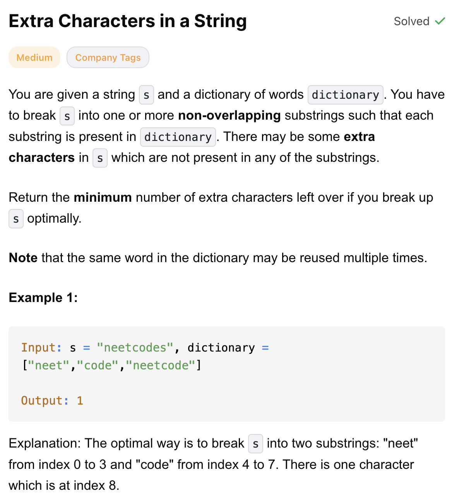
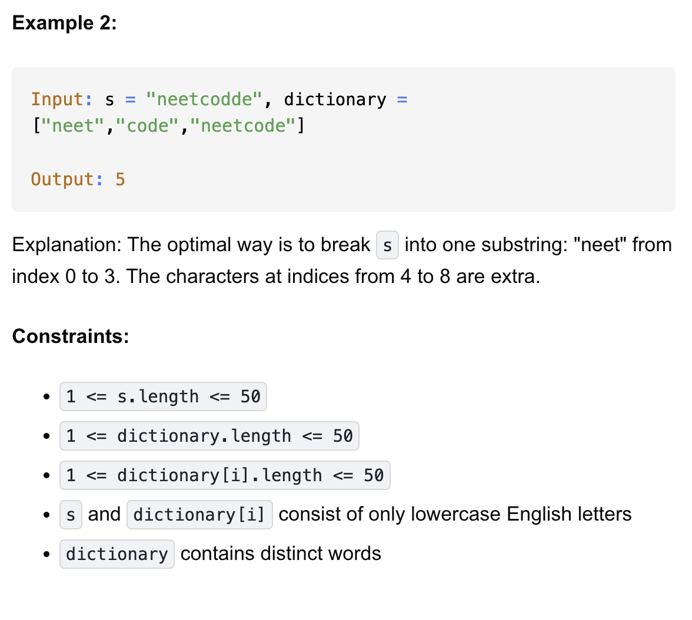

# 2707-Extra Characters in a String-M

## 题目描述



题意：
- s是字符串，dictionary 是元素为字符串的list
- 给s砍几刀，希望子集能尽可能多的是dictionary里的元素
- 返回无法match dictionary的s字符个数

解法：
- Dynamic Programming Using Trie
  - 注意自定义的class TrieNode 和 class Trie写在题目给定的class Solution上面

## Dynamic Programming (Bottom-Up) Using Trie

```python
class TrieNode:
    def __init__(self):
        self.children = {}
        self.isWord = False

class Trie:
    def __init__(self):
        self.root = TrieNode()

    def addWord(self, word):
        curr = self.root
        for c in word:
            if c not in curr.children:
                curr.children[c] = TrieNode()
            curr = curr.children[c]
        curr.isWord = True

class Solution:
    def minExtraChar(self, s: str, dictionary: List[str]) -> int:
        trie = Trie()
        for w in dictionary:
            trie.addWord(w)

        n = len(s)
        dp = [0] * (n + 1)

        for i in range(n - 1, -1, -1):
            dp[i] = 1 + dp[i + 1] # 默认把 s[i] 当作“多余字符”, 所以是1个
            curr = trie.root
            for j in range(i, n): # 枚举所有以 i 开头的子串
                if s[j] not in curr.children:
                    break # 匹配失败，直接 break
                curr = curr.children[s[j]]
                if curr.isWord: # 若为True，那么s[i : j+1] 是字典里的一个词，这段 不算 extra
                    dp[i] = min(dp[i], dp[j + 1]) # dp[i] = min(原本的方案（把 s[i] 当 extra），使用这个单词后的 dp[j+1])
        return dp[0]
```

- TC: O(n^2 + m * k)
- SC: O(n + m * k)

时空复杂度分析：
- 符号：
  - n：字符串 s 的长度
  - m：dictionary 中单词的个数
  - k：字典中单词的平均长度
- TC:
  - 构建 Trie   O(m · k)
  - DP 查找     O(n²)
  - 总时间      O(n² + m · k)
- SC: 
  - Trie 空间   O(m · k)
  - dp 数组     O(n)
  - 总空间      O(n + m · k)


- Trie的结构
  - TrieNode节点上不会有值
  - 最上面的TrieNode为root
  - 每个节点会有children，虽然节点上不会有值，但是children是{}结构，所以key对应的value，key为字符，value为节点（相当于字符值在节点间的连接线上

- dp[i] 表示：从下标 i 开始，到字符串末尾，最少需要“多余（无法匹配字典）字符”的数量。
- 最终要求的是 dp[0]：整个字符串的最少多余字符数